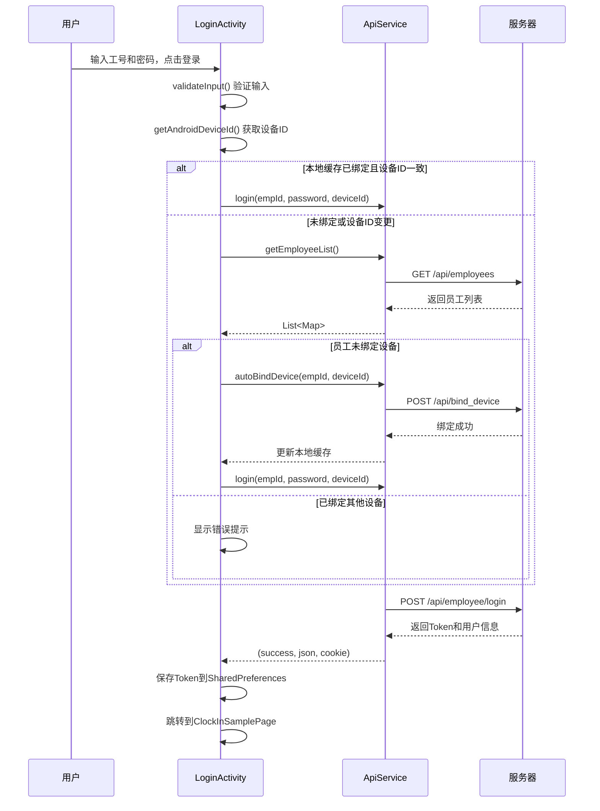
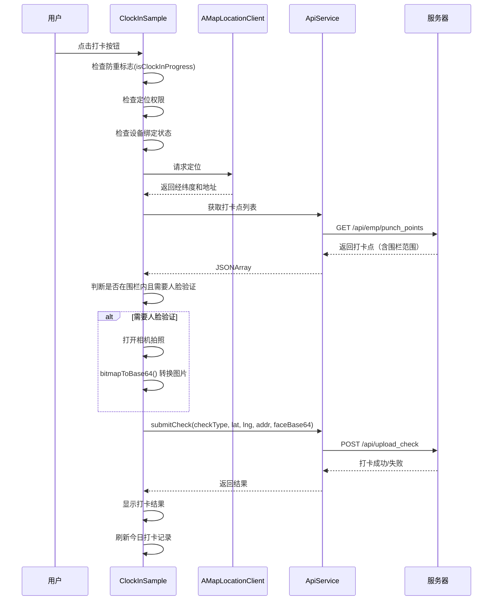
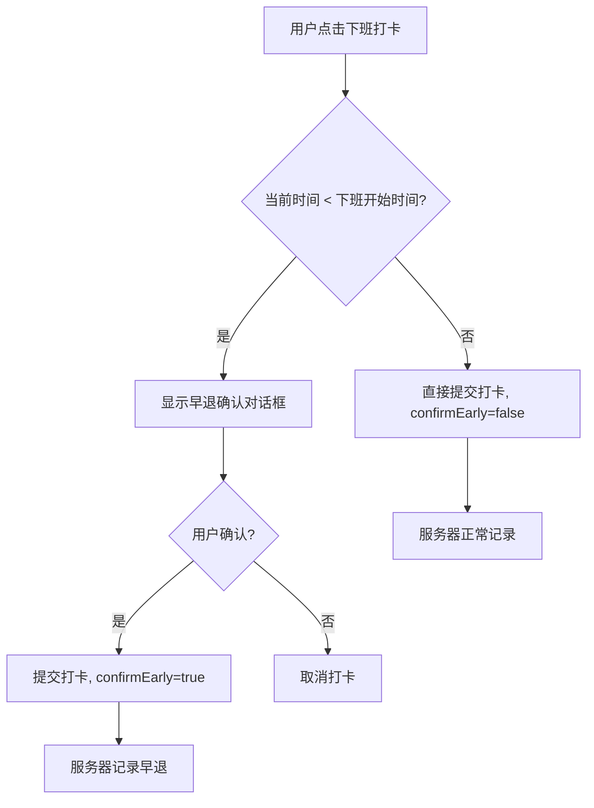

# 亿杰智企综合管理平台 - 移动端项目文档

## 1. 项目概述

### 1.1 项目简介

**项目名称**：yjx_clockin（亿杰智企综合管理平台移动端）

**项目类型**：Android 考勤打卡应用

**核心功能**：员工考勤打卡、设备绑定、人脸验证、审批流程、个人信息管理

**技术栈**：
- 语言：Kotlin
- 框架：Android Jetpack（Compose、ViewBinding、Fragment）
- 地图：高德地图SDK（AMap）
- 网络：OkHttp、Retrofit
- UI：Material Design 3

### 1.2 项目架构

```
┌─────────────────────────────────────────────────────────────┐
│                      应用层 (UI)                            │
│  LoginActivity │ ClockInSamplePage │ WebViewActivity       │
├─────────────────────────────────────────────────────────────┤
│                      业务层 (Fragment)                      │
│  ClockInSample │ WorkbenchContent │ ProfileContent        │
├─────────────────────────────────────────────────────────────┤
│                      数据层 (Utils/Model)                   │
│  ApiService │ DialogUtils │ WorkbenchAdapter              │
│  MenuButton │ PersonalRecord                               │
├─────────────────────────────────────────────────────────────┤
│                      依赖库                                  │
│  高德地图 │ OkHttp │ Retrofit │ Glide │ RecyclerView       │
└─────────────────────────────────────────────────────────────┘
```

---

## 2. 目录结构

```
app/
├── libs/                              # 第三方库（高德地图SDK）
│   ├── arm64-v8a/
│   ├── armeabi-v7a/
│   └── *.jar
├── src/
│   └── main/
│       ├── java/com/example/yjx_clockin/
│       │   ├── model/                 # 数据模型
│       │   │   └── MenuButton.kt
│       │   ├── ui/theme/              # Compose 主题配置
│       │   │   ├── Color.kt
│       │   │   ├── Theme.kt
│       │   │   └── Type.kt
│       │   ├── utils/                 # 工具类
│       │   │   ├── ApiService.kt
│       │   │   ├── DialogUtils.kt
│       │   │   └── WorkbenchAdapter.kt
│       │   ├── ClockInSample.kt       # 打卡Fragment
│       │   ├── ClockInSamplePage.kt   # 主页Activity
│       │   ├── FragmentAdapter.kt     # ViewPager2适配器
│       │   ├── LoginActivity.kt       # 登录Activity
│       │   ├── ProfileContent.kt      # 个人中心Fragment
│       │   └── WorkbenchContent.kt    # 工作台Fragment
│       ├── res/                       # 资源文件
│       │   ├── drawable/              # 图片资源
│       │   ├── layout/                # 布局文件
│       │   ├── mipmap-*/              # 图标资源
│       │   └── values/                # 配置文件
│       └── AndroidManifest.xml        # 应用配置
├── build.gradle.kts                   # 模块构建配置
└── proguard-rules.pro                 # 混淆规则
```

---

## 3. 核心组件说明

### 3.1 登录模块 - LoginActivity

**文件路径**：[app/src/main/java/com/example/yjx_clockin/LoginActivity.kt](file:///workspace/app/src/main/java/com/example/yjx_clockin/LoginActivity.kt)

**职责**：处理用户登录、设备绑定验证、账号密码管理

**核心功能**：
| 功能 | 说明 | 关键方法 |
|------|------|----------|
| 账号密码验证 | 验证员工编号和密码非空 | `validateInput()` |
| 设备绑定检查 | 获取Android设备ID并验证绑定状态 | `checkAndBindDevice()` |
| 自动绑定设备 | 未绑定时自动绑定当前设备 | `autoBindDevice()` |
| 登录请求 | 调用登录接口获取Token | `performLogin()` |
| 记住密码 | 使用SharedPreferences保存凭证 | `saveCredentials()` |

**登录流程**：
```
用户输入 → 验证输入 → 检查设备绑定 → 自动绑定(如需) → 请求登录 → 保存Token → 跳转到主页
```

### 3.2 打卡模块 - ClockInSample

**文件路径**：[app/src/main/java/com/example/yjx_clockin/ClockInSample.kt](file:///workspace/app/src/main/java/com/example/yjx_clockin/ClockInSample.kt)

**职责**：核心打卡功能，包含地图展示、定位、人脸验证、时间规则校验

**核心属性**：
| 属性 | 类型 | 说明 |
|------|------|------|
| `mLocationClient` | AMapLocationClient | 高德定位客户端 |
| `aMap` | AMap | 地图实例 |
| `punchPoints` | List<JSONObject> | 打卡点列表（含围栏范围） |
| `timeRule` | PunchTimeRule | 时间规则（上班截止时间、下班开始时间等） |
| `isClockInProgress` | Boolean | 防重复打卡标志 |

**核心方法**：
| 方法 | 说明 |
|------|------|
| `initAmapLocation()` | 初始化高德定位服务 |
| `fetchPunchPointsAndDrawFence()` | 获取打卡点并在地图绘制围栏 |
| `isFaceRequiredAtLocation()` | 判断当前位置是否需要人脸验证 |
| `performCheckIn()` | 执行上班打卡 |
| `performCheckOut()` | 执行下班打卡（含早退确认） |
| `submitCheck()` | 提交打卡请求到服务器 |

**时间规则数据类**：
```kotlin
data class PunchTimeRule(
    val checkInDeadline: String,    // 上班截止时间（如 "09:30"）
    val checkOutStart: String,      // 下班开始时间（如 "18:00"）
    val lateMinutes: Int,           // 迟到阈值（分钟）
    val earlyLeaveMinutes: Int      // 早退阈值（分钟）
)
```

### 3.3 工作台模块 - WorkbenchContent

**文件路径**：[app/src/main/java/com/example/yjx_clockin/WorkbenchContent.kt](file:///workspace/app/src/main/java/com/example/yjx_clockin/WorkbenchContent.kt)

**职责**：展示员工工作台，包含个人记录、申请菜单、审批菜单（按角色权限显示）

**功能结构**：
- **个人记录区**：报销记录、请假记录、调休记录、外出记录、采购记录、加班记录、费用申请、工资条
- **申请菜单**：请假申请、调休申请、报销申请、外出申请、加班申请、采购申请、费用申请
- **审批菜单**：根据用户角色动态显示（admin、manager、supervisor、finance等）

**角色权限映射**：
| 菜单 | 所需角色 |
|------|----------|
| 请假审批 | admin, manager, supervisor, general_manager, tech_supervisor, hr_supervisor |
| 调休审批 | admin, manager, supervisor, general_manager, tech_supervisor, hr_supervisor |
| 外出审批 | admin, manager, supervisor, general_manager, tech_supervisor, hr_supervisor |
| 加班审批 | admin, manager, supervisor, general_manager, tech_supervisor, hr_supervisor |
| 报销审批 | admin, finance, accountant, general_manager, supervisor, manager, tech_supervisor |
| 采购审批 | admin, manager, supervisor, general_manager, tech_supervisor, purchaser, storekeeper |
| 费用审批 | admin, finance, accountant, general_manager, supervisor, tech_supervisor |

### 3.4 个人中心模块 - ProfileContent

**文件路径**：[app/src/main/java/com/example/yjx_clockin/ProfileContent.kt](file:///workspace/app/src/main/java/com/example/yjx_clockin/ProfileContent.kt)

**职责**：展示个人信息、设备绑定状态、修改密码、退出登录

**核心功能**：
| 功能 | 说明 |
|------|------|
| 信息展示 | 用户名、部门、工号、电话、邮箱、入职日期 |
| 头像加载 | 从Base64解码并显示 |
| 设备状态 | 显示当前设备绑定状态 |
| 修改密码 | 验证原密码后修改新密码 |
| 关于系统 | 显示版本信息 |
| 退出登录 | 清除本地缓存并返回登录页 |

### 3.5 网络请求工具 - ApiService

**文件路径**：[app/src/main/java/com/example/yjx_clockin/utils/ApiService.kt](file:///workspace/app/src/main/java/com/example/yjx_clockin/utils/ApiService.kt)

**职责**：封装所有API请求，管理认证Token

**基础配置**：
- **BASE_URL**：`http://117.36.73.158:5000`
- **认证方式**：Bearer Token

**API接口列表**：
| 方法 | 接口路径 | 说明 |
|------|----------|------|
| `login()` | `/api/employee/login` | 员工登录 |
| `getEmployeeList()` | `/api/employees` | 获取员工列表 |
| `getEmployeeDetail()` | `/api/employees?keyword={empId}` | 获取员工详情 |
| `getCurrentUser()` | `/api/current_user` | 获取当前用户信息 |
| `getMobileMenu()` | `/employee/mobile` | 获取移动端菜单 |
| `getMyLeaves()` | `/api/leave/my` | 获取我的请假记录 |
| `getMyExchanges()` | `/api/exchange/my` | 获取我的调休记录 |
| `getMyExpenses()` | `/api/expense/my` | 获取我的报销记录 |
| `changePassword()` | `/api/employee/change_password` | 修改密码 |

**Token管理**：
```kotlin
fun setToken(token: String)    // 设置全局Token
fun clearToken()               // 清除Token
fun buildRequest(url, method, body)  // 构建带认证头的请求
```

### 3.6 对话框工具 - DialogUtils

**文件路径**：[app/src/main/java/com/example/yjx_clockin/utils/DialogUtils.kt](file:///workspace/app/src/main/java/com/example/yjx_clockin/utils/DialogUtils.kt)

**职责**：统一对话框样式，提供便捷的弹窗方法

**核心方法**：
```kotlin
fun showCustomDialog(
    context: Context,
    title: String?,           // 标题（可选）
    message: String,          // 消息内容
    iconRes: Int?,            // 图标资源（可选）
    positiveText: String,     // 确定按钮文字
    negativeText: String?,    // 取消按钮文字（可选）
    onPositive: (() -> Unit)?, // 确定回调
    onNegative: (() -> Unit)? // 取消回调
)
```

---

## 4. 关键业务流程

### 4.1 登录流程



### 4.2 打卡流程



### 4.3 早退确认流程



---

## 5. 权限说明

| 权限 | 用途 | 权限级别 |
|------|------|----------|
| `INTERNET` | 网络请求 | 正常权限 |
| `ACCESS_FINE_LOCATION` | GPS精确定位 | 危险权限 |
| `ACCESS_COARSE_LOCATION` | 网络定位 | 危险权限 |
| `ACCESS_NETWORK_STATE` | 获取网络状态 | 正常权限 |
| `ACCESS_WIFI_STATE` | 获取WiFi信息 | 正常权限 |
| `CHANGE_WIFI_STATE` | 修改WiFi状态 | 正常权限 |
| `WRITE_EXTERNAL_STORAGE` | 地图瓦片缓存 | 危险权限（API<29） |
| `READ_EXTERNAL_STORAGE` | 读取缓存 | 危险权限（API<33） |
| `CAMERA` | 人脸拍照验证 | 危险权限 |

---

## 6. 依赖库列表

| 依赖 | 版本 | 用途 |
|------|------|------|
| `androidx.activity.compose` | - | Compose Activity支持 |
| `androidx.appcompat` | 1.6.1 | 兼容库 |
| `androidx.compose.material3` | - | Material Design 3 |
| `androidx.recyclerview` | 1.3.0 | 列表组件 |
| `com.squareup.okhttp3:okhttp` | 4.12.0 | 网络请求 |
| `com.squareup.retrofit2:retrofit` | 2.9.0 | REST API框架 |
| `com.amap.api:3dmap-location-search` | latest | 高德地图SDK |
| `com.github.bumptech.glide:glide` | 4.15.0 | 图片加载 |
| `de.hdodenhof:circleimageview` | 3.1.0 | 圆形图片View |
| `org.jetbrains.kotlinx:kotlinx-coroutines-android` | 1.6.4 | 协程 |

---

## 7. 项目运行

### 7.1 环境要求

- **Android SDK**：API 36（compileSdk）
- **最小支持版本**：API 24（Android 7.0）
- **构建工具**：Gradle 8.x
- **Kotlin版本**：与Compose兼容的版本

### 7.2 构建命令

```bash
# 构建Debug版本
./gradlew assembleDebug

# 构建Release版本
./gradlew assembleRelease

# 运行测试
./gradlew test
```

### 7.3 签名配置

项目使用 `yjx_clockin_release.jks` 进行Release签名，配置在 `build.gradle.kts` 中。

### 7.4 高德地图API Key

在 `AndroidManifest.xml` 中配置：
```xml
<meta-data
    android:name="com.amap.api.v2.apikey"
    android:value="aaf5aed3e0bda48b4ac150ceb445dca8"/>
```

---

## 8. 数据存储

### 8.1 SharedPreferences 键值列表

| Key | 类型 | 说明 |
|-----|------|------|
| `token` | String | 登录Token |
| `emp_id` | String | 员工编号 |
| `emp_name` | String | 员工姓名 |
| `cookie` | String | 登录Cookie |
| `device_bound` | Boolean | 设备绑定状态 |
| `device_id` | String | 绑定的设备ID |
| `saved_emp_id` | String | 记住的账号 |
| `saved_password` | String | 记住的密码 |
| `remember_password` | Boolean | 是否记住密码 |

---

## 9. 安全特性

| 特性 | 说明 | 实现位置 |
|------|------|----------|
| 设备绑定 | 账号只能在绑定的设备上登录 | LoginActivity, ClockInSample |
| 虚拟定位检测 | 检测并拒绝模拟位置打卡 | ClockInSample |
| Token认证 | 所有API请求携带Bearer Token | ApiService |
| 防重复打卡 | 避免重复提交打卡请求 | ClockInSample |
| 密码本地加密 | 记住密码功能 | LoginActivity |

---

## 10. 代码优化建议

### 10.1 待优化项

| 问题 | 位置 | 建议 |
|------|------|------|
| 网络请求未统一处理错误 | ApiService | 封装统一的错误处理和重试机制 |
| 硬编码URL | ApiService | 抽取到配置文件或BuildConfig |
| 缺少数据缓存策略 | 全局 | 引入Room数据库缓存打卡点等数据 |
| UI线程操作冗余 | 多处 | 使用协程简化线程切换 |
| 权限请求未封装 | 多处 | 抽取权限请求工具类 |
| 日志未分级 | 多处 | 使用Timber等日志框架 |

### 10.2 潜在问题

1. **网络超时处理**：部分请求缺少超时配置（已在ClockInSample中配置30秒）
2. **内存泄漏风险**：Fragment中的异步回调需要注意生命周期管理
3. **图片资源优化**：部分drawable资源未提供多种分辨率版本

---

## 附录：资源文件说明

### A. 图标资源（drawable）

| 文件名 | 用途 |
|--------|------|
| `ic_clock.png` | 打卡Tab图标 |
| `ic_tab_workbench.png` | 工作台Tab图标 |
| `ic_tab_profile.png` | 个人中心Tab图标 |
| `ic_leave.png` | 请假相关图标 |
| `ic_expense.png` | 报销相关图标 |
| `ic_overtime.png` | 加班相关图标 |
| `clock_in_local.png` | 打卡点标记图标 |
| `bg_fence_*.xml` | 围栏样式 |

### B. 布局文件（layout）

| 文件名 | 对应组件 |
|--------|----------|
| `activity_login.xml` | LoginActivity |
| `activity_clock_in_sample_page.xml` | ClockInSamplePage |
| `activity_clock_in_sample.xml` | ClockInSample Fragment |
| `activity_workbench_content.xml` | WorkbenchContent Fragment |
| `activity_profile_content.xml` | ProfileContent Fragment |
| `fragment_workbench.xml` | 工作台列表布局 |
| `dialog_custom_layout.xml` | 自定义对话框布局 |
| `dialog_change_password.xml` | 修改密码对话框 |

---

**文档版本**：v1.0  
**生成日期**：2026-06-22  
**项目版本**：1.0